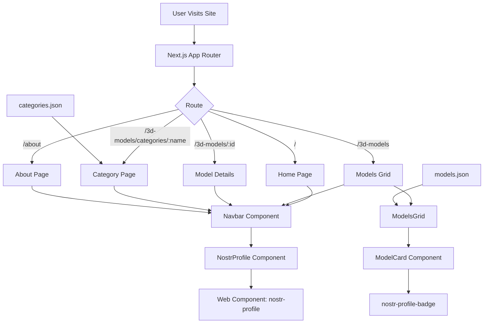

<h1 align="center">The Print Forge</h1>

A simple interactive 3D model marketplace which is built with **Next.js**. Where you can explore and discover printable 3D models organized by categories with Nostr integration for social features.


### Visit [The print forge on GitHub Pages](https://the-print-forge.vercel.app).

---


## 📋 Overview

The Print Forge is a showcase platform for discovering and exploring 3D printable models. Users can browse models by category, view detailed information, and interact with the community through Nostr protocol integration.

## 🌟 Features

### Core Functionality
- **Model Catalog**: Browse a curated collection of 3D printable models.

- **Category Navigation**: Organized by different model categories.

- **Detailed Model Pages**: View comprehensive information about each model.

- **Responsive Design**: Mobile-first, works seamlessly on all devices.

- **Search & Filter**: Easy navigation through the model library.


### Technical Features
- **Type-Safe**: Full TypeScript support throughout the application.

- **Server Components**: Leverages Next.js 16 App Router for optimized
performance.

- **Modern UI**: Built with Tailwind CSS for beautiful, responsive interfaces.

- **Web Fonts**: Custom fonts (Albert Sans, Montserrat Alternates) via Google Fonts.

- **Web Components**: Nostr profile integration using web components.


### Social Integration
- **Nostr Protocol**: Built-in Nostr profile and badge components.

- **Community Features**: Display creator/author profiles.

- **Decentralized**: Leverages Nostr for social verification.

## 📚 Learnings


- Learned about Server vs. Client Components architecture in React and Next.js.
- Learned about App Router and dynamic routes.

- Practiced Font optimization with next/font.

- Practiced typeScript integration.

- Added Web Component type definitions for TypeScript.

- Implemented Nostr protocol.

- Created Type-safe component props.

## 🏗️ Application Architecture



## 💻 Technology Stack

| Category | Technologies |
|----------|-------------|
| **Frontend Framework** | Next.js 16.1.1, React 19.2.3 |
| **Language** | TypeScript 5 |
| **Styling** | Tailwind CSS 3.4.19, PostCSS |
| **Social Integration** | Nostr Components 0.4.3 |
| **Icons** | React Icons 5.5.0 |
| **Build Tool** | Turbopack |
| **Font Management** | Next.js Google Fonts |
| **Web Components** | Custom Nostr Elements |

## 📁 Project Structure

```
the-print-forge/
├── app/
│   ├── layout.tsx                 # Root layout with fonts
│   ├── page.tsx                   # Home page
│   ├── globals.css                # Global styles
│   ├── 3d-models/
│   │   ├── layout.tsx             # Models layout
│   │   ├── page.tsx               # Models grid
│   │   ├── [id]/
│   │   │   └── page.tsx           # Individual model page
│   │   └── categories/
│   │       └── [categoryName]/
│   │           └── page.tsx       # Category filtered models
│   ├── about/
│   │   └── page.tsx               # About page
│   ├── components/
│   │   ├── Navbar.tsx             # Navigation bar
│   │   ├── NostrProfile.tsx       # Nostr profile component
│   │   ├── ModelCard.tsx          # Model card display
│   │   ├── ModelsGrid.tsx         # Grid layout
│   │   ├── CategoriesNav.tsx      # Category navigation
│   │   ├── NavLink.tsx            # Navigation links
│   │   └── Pill.tsx               # Badge/pill component
│   ├── data/
│   │   ├── models.json            # Model database
│   │   └── categories.json        # Category data
│   ├── lib/
│   │   ├── models.ts              # Model utilities
│   │   └── categories.ts          # Category utilities
│   └── types/
│       ├── index.tsx              # Type definitions
│       └── nostr.d.ts             # Nostr component types
├── types/
│   └── nostr-components.d.ts      # Web component type definitions
├── tsconfig.json                  # TypeScript configuration
├── tailwind.config.js             # Tailwind configuration
├── postcss.config.js              # PostCSS configuration
├── next.config.js                 # Next.js configuration
└── package.json                   # Dependencies
```

## 🚀 Getting Started

### Prerequisites
- Node.js 18+ 
- npm or yarn

### Installation

```bash
# Clone the repository
git clone https://github.com/yourusername/the-print-forge.git
cd the-print-forge

# Install dependencies
npm install

# Start development server
npm run dev
```

The application will be available at **http://localhost:3000**

### Available Scripts

| Command | Description |
|---------|-------------|
| `npm run dev` | Start development server with hot reload |
| `npm run build` | Build optimized production bundle |
| `npm start` | Start production server |
| `npm run lint` | Run ESLint for code quality |


## 🙏 Acknowledgments

- [Nostr Components](https://www.npmjs.com/package/nostr-components) for social protocol integration
- [Next.js](https://nextjs.org/) for the modern React framework
- [Tailwind CSS](https://tailwindcss.com/) for utility-first styling

##

<div align="center">

### 🛠️ Built With

**Next.js** • **React** • **TypeScript** • **Tailwind CSS** • **Nostr Protocol**

Explore, Create & Share.


</div>